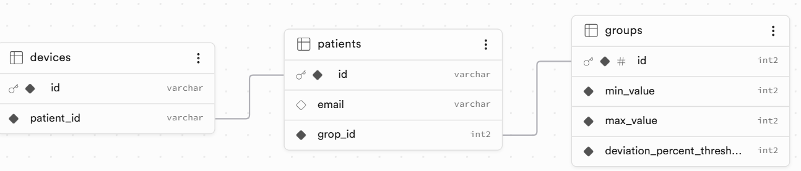

# Writing device_data_provder retrieving required Data from PostgreSQL
## Creating and filling three tables in Supabase SaaS (Software as a Servoice)
 
## Update lambda function device_data_provider code 
- SQL query instead of hard-coded configuration with consideration of using package psycopg ( add into requirements.txt)
- OPtionally. consider using AWS Secrets Manager Service for keeping DB Password with getting password at initial function invocation
## Update template file 
- add required ENV variables for connecting with DB
### only for AWS Secrets Manager
- permission for Secrets Manger and secret with DB Password ARN (implied that secret had been set before sam build/deploy)

