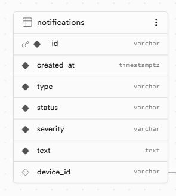

# Notifications-abnormal-values-popultor
## Lambda function
- receives event from SNS Abnormal pulse values topic
- inserts row inside table "notifications"
## Notifications table according following schema

- type "ABNORMAL-VALUES"
- status "CREATED"
- severity "MINOR" - Deviation from normal central value and median value is 60% - 70%
- severity "MAJOR" - Deviation from normal central value and median value is 71% - 90%
- severity "CRITICAL" - Deviation from normal central value and median value is more 90%

